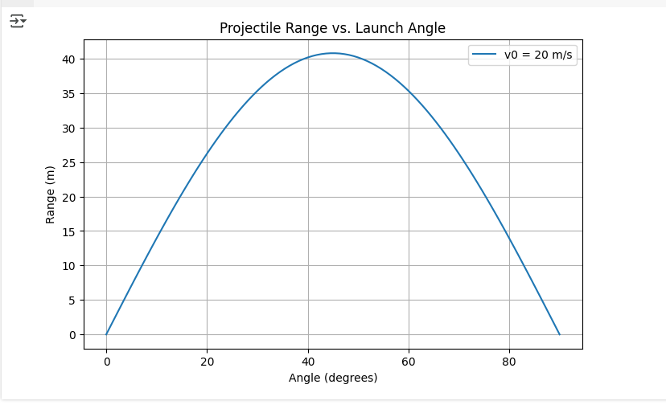
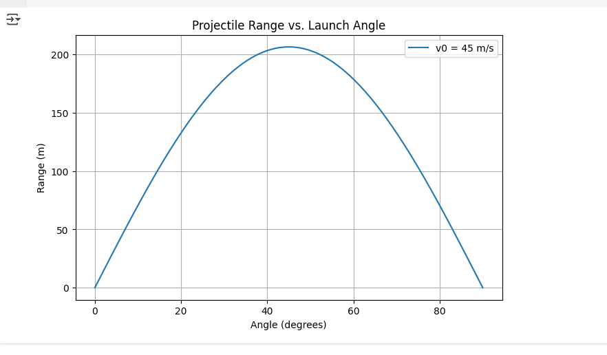
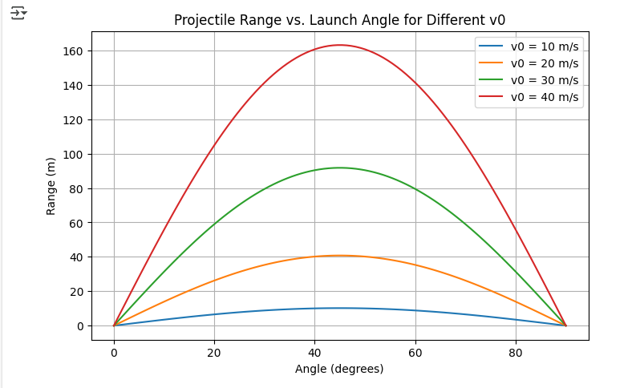
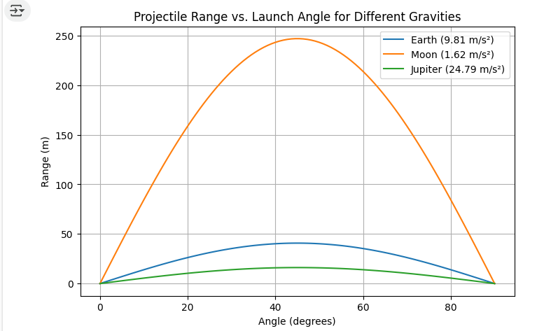

# **Problem 1: Investigating the Range as a Function of the Angle of Projection**

## **1. Theoretical Foundation**
Projectile motion is a type of two-dimensional motion where an object is launched into the air with an initial velocity $v_0$ at an angle $\theta$ relative to the horizontal. The motion can be analyzed by breaking it into horizontal (x) and vertical (y) components.

### **1.1 Equations of Motion**
The horizontal and vertical components of the initial velocity are:

$$v_{0x} = v_0 \cos(\theta)$$ 

$$v_{0y} = v_0 \sin(\theta)$$

Using the kinematic equations, the motion in each direction is governed by:
- **Horizontal motion (constant velocity, no acceleration in the ideal case):**
  $$x = v_{0x} t = v_0 \cos(\theta) t$$
- **Vertical motion (accelerated due to gravity):**
  $$y = v_{0y} t - \frac{1}{2} g t^2$$

where:

- $g$ is the acceleration due to gravity $(9.81 \text{ m/s}^2)$
- $t$ is the time of flight.

### **1.2 Time of Flight**

The time of flight is determined by solving for when the projectile returns to the ground $(y = 0)$:
$$t = \frac{2 v_0 \sin(\theta)}{g}$$

### **1.3 Range Equation**
The range $$R$$ is the horizontal distance traveled when the projectile lands:
$$R = v_{0x} \cdot t = v_0 \cos(\theta) \cdot \frac{2 v_0 \sin(\theta)}{g}$$

Using the identity $$2 \sin(\theta) \cos(\theta) = \sin(2\theta)$$, we get:
$$R = \frac{v_0^2 \sin(2\theta)}{g}$$

## **2. Analysis of the Range**

- The range is maximized when $$\sin(2\theta) = 1$$, which occurs at $$2\theta = 90^\circ$$, or $$\theta = 45^\circ$$.
- If the initial velocity $$v_0$$ increases, the range increases quadratically.
- If gravity $$g$$ increases (e.g., on another planet), the range decreases.

## **3. Practical Applications**

- **Sports:** Understanding projectile motion is crucial in games like soccer, basketball, and golf.
- **Engineering:** Used in ballistics, rocketry, and artillery targeting systems.
- **Real-World Effects:** Air resistance, wind, and uneven terrain can significantly alter the theoretical range.

## **4. Implementation: Python Simulation**
The following Python script simulates projectile motion and plots the range as a function of the angle of projection.

```python
import numpy as np
import matplotlib.pyplot as plt

def projectile_range(v0_lıst, g=9.81):
    angles = np.linspace(0, 90, 100)  # Angle range from 0 to 90 degrees
    angles_rad = np.radians(angles)  # Convert degrees to radians
    ranges = (v0**2 * np.sin(2 * angles_rad)) / g  # Compute range
    
    plt.figure(figsize=(8, 5))
    plt.plot(angles, ranges, label=f'v0 = {v0} m/s')
    plt.xlabel("Angle (degrees)")
    plt.ylabel("Range (m)")
    plt.title("Projectile Range vs. Launch Angle")
    plt.legend()
    plt.grid()
    plt.show()


projectile_range(v0=20)
```

## **V0=20**


## **V0=45(TOP ONE)**


## **5. Frequently Asked Questions (FAQ)**  

### **1. At what angle is the maximum range achieved in projectile motion?**  
- The maximum range is achieved at **45°** in ideal conditions without air resistance.  

### **2. How does the initial velocity affect the range?**  
- The range increases **quadratically (v₀²)** as the initial velocity increases.  

### **3. What happens if gravity changes?**  
- A higher gravitational acceleration **reduces the range**, while a lower gravity **increases it**.  

### **4. Does mass affect the projectile's range?**  
- No, in ideal conditions without air resistance, mass does not affect the range.  

### **5. How does air resistance impact projectile motion?**  
- Air resistance **reduces the range**, alters the trajectory, and affects the optimal launch angle.  

## **Explanation of the Graph**  

This graph illustrates how the horizontal range of a projectile depends on the launch angle for different initial velocities (\( v_0 \)).  

- Each curve represents a different initial velocity.  
- The maximum range occurs at **45°**.  
- As the initial velocity increases, the range increases **quadratically (\( v_0^2 \))**.  
- Lower initial velocities result in shorter ranges, while higher velocities allow the projectile to travel further.  

This helps in understanding how objects like balls, bullets, or rockets behave when launched at different speeds and angles. 🚀  

```python
import numpy as np
import matplotlib.pyplot as plt

def projectile_range_multi_v0(v0_list, g=9.81):
    angles = np.linspace(0, 90, 100)
    angles_rad = np.radians(angles)
    
    plt.figure(figsize=(8, 5))
    for v0 in v0_list:
        ranges = (v0**2 * np.sin(2 * angles_rad)) / g
        plt.plot(angles, ranges, label=f'v0 = {v0} m/s')
    
    plt.xlabel("Angle (degrees)")
    plt.ylabel("Range (m)")
    plt.title("Projectile Range vs. Launch Angle for Different v0")
    plt.legend()
    plt.grid()
    plt.show()

projectile_range_multi_v0([10, 20, 30, 40])
```



## **Explanation of the Graph**  

This graph shows how the horizontal range of a projectile changes with the launch angle for different gravitational accelerations ($g$).  

- Each curve represents a different gravitational environment: Earth ($g = 9.81 \, \text{m/s}^2$), Moon ($g = 1.62 \, \text{m/s}^2$), and Jupiter ($g = 24.79 \, \text{m/s}^2$).
- As gravity decreases (like on the Moon), the range increases for the same initial velocity.
- On higher gravity bodies (like Jupiter), the range decreases.

This graph helps understand how the same projectile behaves differently in various planetary environments. 🌍🌑🪐  


```python
import numpy as np
import matplotlib.pyplot as plt

def projectile_range_multi_g(v0=20, g_values=[9.81, 1.62, 24.79]):
    angles = np.linspace(0, 90, 100)
    angles_rad = np.radians(angles)
    g_labels = ["Earth (9.81 m/s²)", "Moon (1.62 m/s²)", "Jupiter (24.79 m/s²)"]
    
    plt.figure(figsize=(8, 5))
    for g, label in zip(g_values, g_labels):
        ranges = (v0**2 * np.sin(2 * angles_rad)) / g
        plt.plot(angles, ranges, label=label)
    
    plt.xlabel("Angle (degrees)")
    plt.ylabel("Range (m)")
    plt.title("Projectile Range vs. Launch Angle for Different Gravities")
    plt.legend()
    plt.grid()
    plt.show()

# Example usage
projectile_range_multi_g()

```

