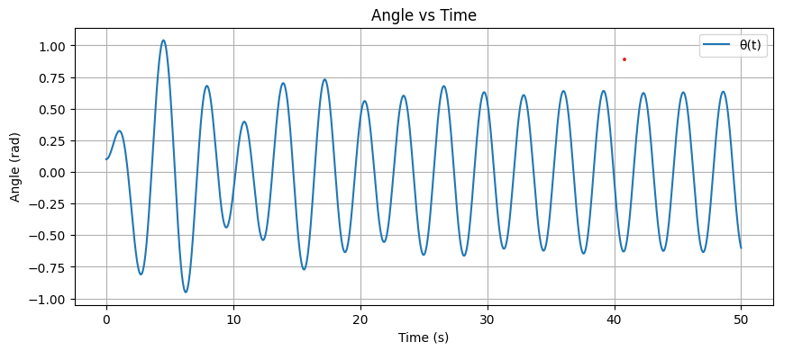
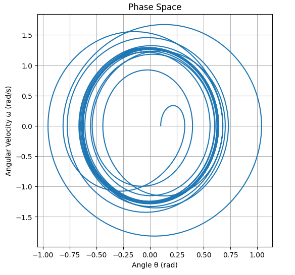
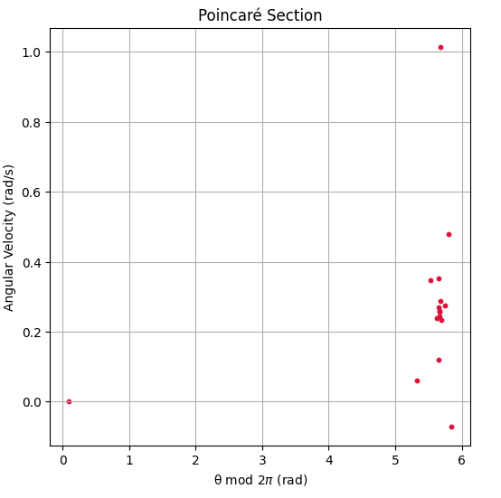
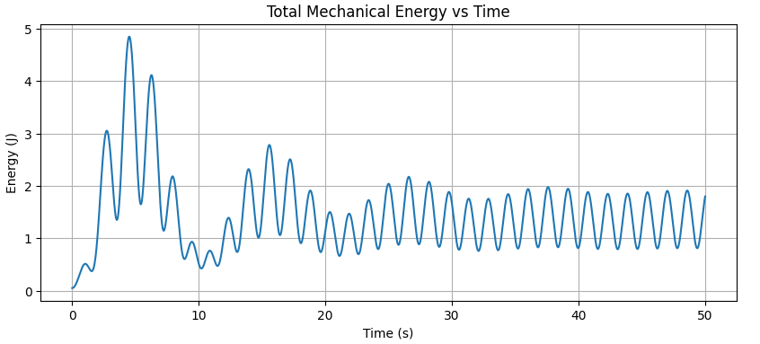
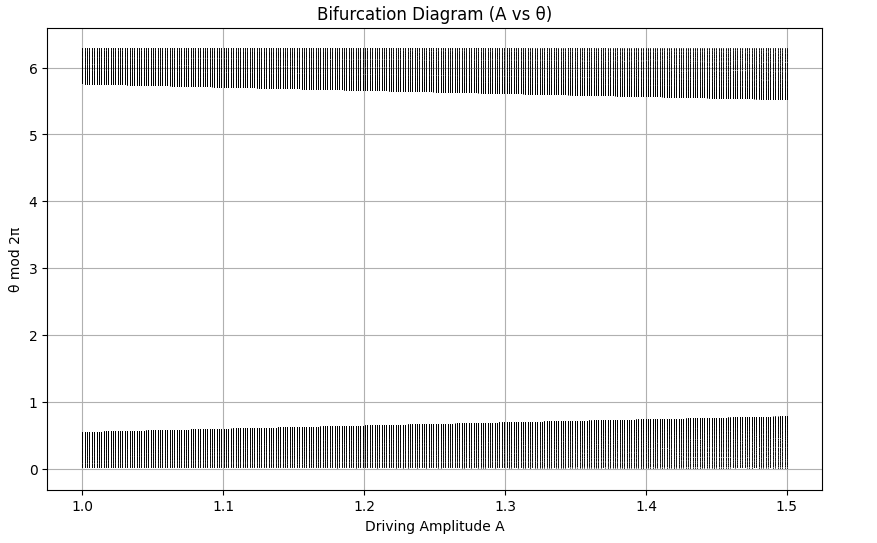
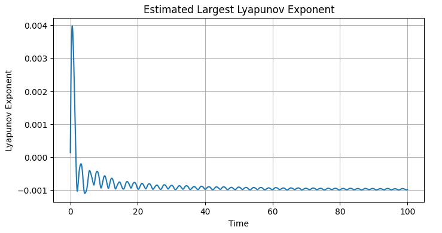

# Investigating the Dynamics of a Forced Damped Pendulum

## Motivation

The forced damped pendulum is a classic example of nonlinear dynamics. Unlike simple harmonic oscillators, this system responds to periodic external forces and damping, producing rich behavior that includes resonance, synchronization, and even chaos. This kind of system is fundamental in physics and engineering because it mirrors the behavior of real-world systems like suspension bridges, circuits, and mechanical vibration absorbers.

---

## 1. Theoretical Foundation

The general nonlinear equation for the forced damped pendulum is:

$$
\frac{d^2\theta}{dt^2} + \gamma \frac{d\theta}{dt} + \omega_0^2 \sin\theta = A \cos(\omega t)
$$

Where:
- $\theta$: angular displacement (radians)
- $\gamma$: damping coefficient (how quickly oscillations die out)
- $\omega_0$: natural angular frequency ($\omega_0 = \sqrt{g / L}$ for a pendulum of length $L$)
- $A$: amplitude of external force
- $\omega$: driving frequency

### Small-Angle Approximation
When $\theta$ is small (typically less than 10°), we can use the approximation:

$$
\sin\theta \approx \theta
$$

This simplifies the equation to:

$$
\frac{d^2\theta}{dt^2} + \gamma \frac{d\theta}{dt} + \omega_0^2 \theta = A \cos(\omega t)
$$

This form is a linear second-order ODE, easier to solve and useful for studying resonance behavior.

---

## 2. Python Simulation

Let's simulate the pendulum using numerical methods. We'll use the Runge-Kutta method via `scipy.integrate.solve_ivp`.

```python
import numpy as np
import matplotlib.pyplot as plt
from scipy.integrate import solve_ivp

# Differential equation
def pendulum(t, y, gamma, omega0, A, omega):
    theta, omega_theta = y
    dydt = [omega_theta, -gamma * omega_theta - omega0**2 * np.sin(theta) + A * np.cos(omega * t)]
    return dydt

# Parameters
gamma = 0.2
omega0 = 1.5
A = 1.2
omega_drive = 2.0
y0 = [0.1, 0.0]
t_span = (0, 50)
t_eval = np.linspace(*t_span, 5000)

# Solve the system
sol = solve_ivp(pendulum, t_span, y0, t_eval=t_eval, args=(gamma, omega0, A, omega_drive))

# Plot angle over time
plt.figure(figsize=(10, 4))
plt.plot(sol.t, sol.y[0], label='θ(t)')
plt.title('Angle vs Time')
plt.xlabel('Time (s)')
plt.ylabel('Angle (rad)')
plt.grid(True)
plt.legend()
plt.show()
```



---

## 3. Phase Space (θ vs ω)

This plot helps visualize how the system evolves in state space.

```python
plt.figure(figsize=(6, 6))
plt.plot(sol.y[0], sol.y[1])
plt.title('Phase Space')
plt.xlabel('Angle θ (rad)')
plt.ylabel('Angular Velocity ω (rad/s)')
plt.grid(True)
plt.show()
```


---

## 4. Poincaré Section

The Poincaré section samples the system once per driving cycle, helping identify periodicity and chaos.

```python
T = 2 * np.pi / omega_drive
poincare_times = np.arange(0, t_span[1], T)
poincare_points = []

for t_p in poincare_times:
    idx = np.argmin(np.abs(sol.t - t_p))
    poincare_points.append([sol.y[0][idx] % (2*np.pi), sol.y[1][idx]])

poincare_points = np.array(poincare_points)

plt.figure(figsize=(6, 6))
plt.scatter(poincare_points[:, 0], poincare_points[:, 1], s=10, color='crimson')
plt.title('Poincaré Section')
plt.xlabel('θ mod $2\pi$ (rad)')
plt.ylabel('Angular Velocity (rad/s)')
plt.grid(True)
plt.show()
```



---

## 5. Additional Visualization: Energy Over Time

Visualizing total mechanical energy shows how damping and driving force interact.

```python
mass = 1.0
length = 1.0
g = 9.81

theta = sol.y[0]
omega = sol.y[1]

potential_energy = mass * g * length * (1 - np.cos(theta))
kinetic_energy = 0.5 * mass * (length**2) * omega**2
total_energy = potential_energy + kinetic_energy

plt.figure(figsize=(10, 4))
plt.plot(sol.t, total_energy)
plt.title('Total Mechanical Energy vs Time')
plt.xlabel('Time (s)')
plt.ylabel('Energy (J)')
plt.grid(True)
plt.show()
```



---

## 6. Bifurcation Diagram

Explore how the long-term behavior changes with the driving amplitude A.

```python
bifurcation_A = np.linspace(1.0, 1.5, 300)
steady_states = []

for A_val in bifurcation_A:
    sol = solve_ivp(pendulum, [0, 200], [0.1, 0.0], t_eval=np.linspace(150, 200, 500), args=(gamma, omega0, A_val, omega_drive))
    theta_vals = sol.y[0] % (2 * np.pi)
    steady_states.append((np.full_like(theta_vals, A_val), theta_vals))

plt.figure(figsize=(10, 6))
for A_vals, thetas in steady_states:
    plt.plot(A_vals, thetas, ',k', alpha=0.5)
plt.title("Bifurcation Diagram (A vs θ)")
plt.xlabel("Driving Amplitude A")
plt.ylabel("θ mod 2π")
plt.grid(True)
plt.show()
```



---

## 7. Lyapunov Exponent Estimation

Estimate the largest Lyapunov exponent to determine chaos.

```python
def estimate_lyapunov(delta0=1e-8, T_max=100):
    y1 = np.array([0.1, 0.0])
    y2 = y1 + np.array([delta0, 0])
    times = np.linspace(0, T_max, 10000)
    d_list = []

    for t in range(len(times) - 1):
        sol1 = solve_ivp(pendulum, [times[t], times[t+1]], y1, t_eval=[times[t+1]], args=(gamma, omega0, A, omega_drive))
        sol2 = solve_ivp(pendulum, [times[t], times[t+1]], y2, t_eval=[times[t+1]], args=(gamma, omega0, A, omega_drive))

        y1 = sol1.y[:, -1]
        y2 = sol2.y[:, -1]

        delta = np.linalg.norm(y2 - y1)
        d_list.append(np.log(delta / delta0))
        y2 = y1 + delta0 * (y2 - y1) / delta  # Renormalize

    return times[1:], np.cumsum(d_list) / np.arange(1, len(d_list)+1)

ltimes, lyap = estimate_lyapunov()

plt.figure(figsize=(8, 4))
plt.plot(ltimes, lyap)
plt.title("Estimated Largest Lyapunov Exponent")
plt.xlabel("Time")
plt.ylabel("Lyapunov Exponent")
plt.grid(True)
plt.show()
```



---

## 8. Exploring Parameters

Experimenting with parameters leads to different behaviors:
- Increasing `A` may cause chaotic motion.
- Lowering `γ` shows less damping, leading to longer sustained oscillations.
- Matching `ω` with `ω₀` creates resonance, producing large amplitudes.

---

## 9. Real-World Applications

- **Energy Harvesters**: Pendulums can convert motion into usable energy.
- **Bridge Engineering**: Avoiding resonance in suspension bridges is crucial.
- **Washing Machines**: Proper damping reduces imbalance.
- **Electronics**: RLC circuits have similar equations.
- **Clocks**: Pendulum clocks are based on resonance principles.

---

## 10. Model Limitations and Extensions

- The model assumes ideal sine driving forces.
- Real-world damping is often nonlinear.
- It doesn't account for multi-dimensional motion.

### Possible Extensions
- Add random or non-periodic forcing.
- Add nonlinear damping (quadratic drag).
- Study bifurcation diagrams over varying A or ω.
- Simulate coupled or double pendulums.

