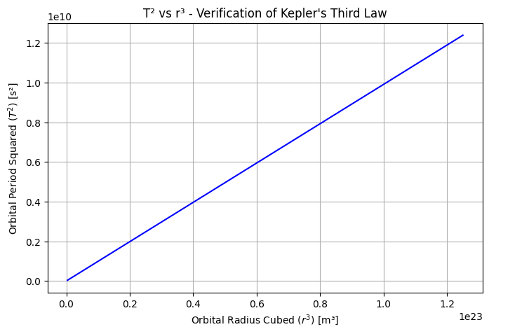
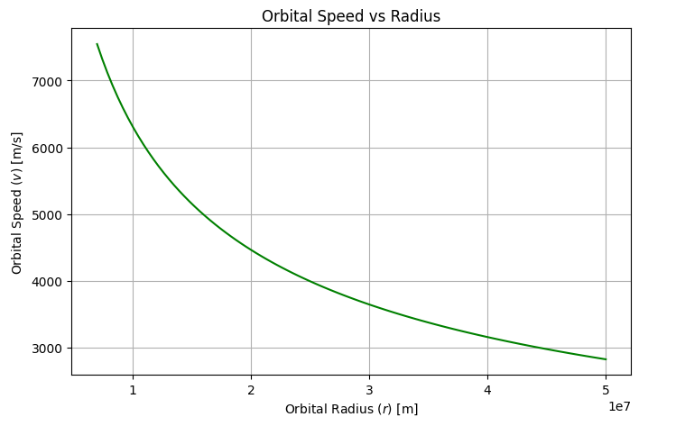
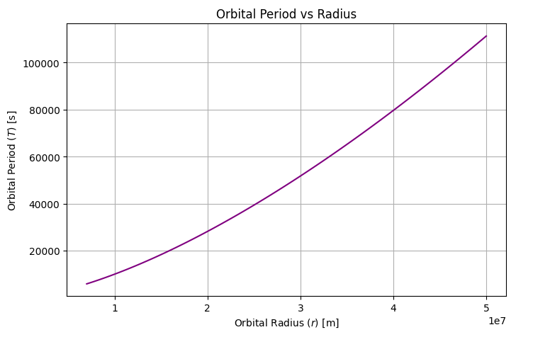
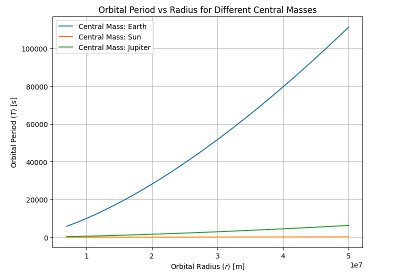
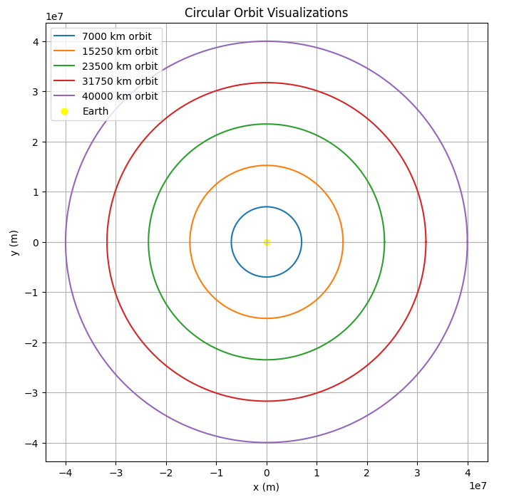

# **Gravity: Orbital Period and Orbital Radius**

---

# **1. Introduction and Motivation**

The relationship between the square of the orbital period ($T^2$) and the cube of the orbital radius ($r^3$) is a cornerstone of celestial mechanics.  
This fundamental principle, known as **Kepler’s Third Law**, is crucial for:

- Understanding planetary motion,
- Designing satellite trajectories,
- Calculating masses of celestial bodies,
- Predicting exoplanet properties.

---

# **2. Theoretical Foundation**

## **2.1 Gravitational Force**

Newton's Law of Universal Gravitation states:

$$
F_{\text{gravity}} = \frac{G M m}{r^2}
$$

where:
- $G$ is the gravitational constant,
- $M$ is the mass of the central body,
- $m$ is the mass of the orbiting body,
- $r$ is the orbital radius.

---

## **2.2 Centripetal Force**

For circular motion, the centripetal force required is:

$$
F_{\text{centripetal}} = \frac{m v^2}{r}
$$

where $v$ is the orbital speed.

---

## **2.3 Orbital Speed**

Setting gravitational force equal to centripetal force:

$$
\frac{G M m}{r^2} = \frac{m v^2}{r}
$$

Simplifying:

$$
v^2 = \frac{G M}{r}
$$

Thus, the orbital speed:

$$
v = \sqrt{\frac{G M}{r}}
$$

---

## **2.4 Orbital Period**

The orbital period $T$ is the time for one full orbit:

$$
T = \frac{2 \pi r}{v}
$$

Substituting $v$:

$$
T = 2 \pi r \sqrt{\frac{r}{G M}}
$$

Squaring both sides:

$$
T^2 = \frac{4 \pi^2 r^3}{G M}
$$

Thus:

$$
T^2 \propto r^3
$$

---

# **3. Practical Applications in Astronomy**

## **3.1 Determining Planetary Masses**

Knowing $T$ and $r$ for a satellite, we can rearrange:

$$
M = \frac{4 \pi^2 r^3}{G T^2}
$$

This is how Earth's mass was first estimated using the Moon!

---

## **3.2 Satellite Orbit Design**

Engineers use $T^2 \propto r^3$ to calculate satellite orbits for:

- GPS systems,
- Communication satellites,
- Weather monitoring.

---

## **3.3 Exoplanet Discovery**

Detecting periodic star wobble allows astronomers to:

- Estimate $r$ and $T$,
- Infer exoplanet mass,
- Predict habitable zones.

---

# **4. Computational Modeling**

Let's simulate and visualize these relationships!

---

## **4.1 Simulating $T^2$ vs $r^3$**

```python
import numpy as np
import matplotlib.pyplot as plt

G = 6.67430e-11  # m^3 kg^-1 s^-2
M = 5.972e24     # Earth's mass (kg)

def orbital_period(r):
    return 2 * np.pi * np.sqrt(r**3 / (G * M))

radii = np.linspace(7e6, 5e7, 100)
periods = orbital_period(radii)

plt.figure(figsize=(8, 5))
plt.plot(radii**3, periods**2, color='blue')
plt.xlabel("Orbital Radius Cubed ($r^3$) [m³]")
plt.ylabel("Orbital Period Squared ($T^2$) [s²]")
plt.title("T² vs r³ - Verification of Kepler's Third Law")
plt.grid()
plt.show()
```



---

## **Graph 1: T² vs r³**

- **Linear** relationship proves Kepler's Third Law.
- Larger radii mean significantly longer periods.

---

## **4.2 Orbital Speed vs Radius**

```python
speeds = np.sqrt(G * M / radii)

plt.figure(figsize=(8, 5))
plt.plot(radii, speeds, color='green')
plt.xlabel("Orbital Radius ($r$) [m]")
plt.ylabel("Orbital Speed ($v$) [m/s]")
plt.title("Orbital Speed vs Radius")
plt.grid()
plt.show()
```



---

## **Graph 2: Orbital Speed vs Radius**

- As $r$ increases, $v$ decreases.
- Distant orbits move slower!

---

## **4.3 Orbital Period vs Radius**

```python
plt.figure(figsize=(8,5))
plt.plot(radii, periods, color='purple')
plt.xlabel("Orbital Radius ($r$) [m]")
plt.ylabel("Orbital Period ($T$) [s]")
plt.title("Orbital Period vs Radius")
plt.grid()
plt.show()
```



---

## **Graph 3: Orbital Period vs Radius**

- $T$ grows faster than $r$.
- Distant satellites have longer periods.

---

## **4.4 Different Central Masses**

```python
masses = [5.972e24, 1.989e30, 1.898e27]
labels = ['Earth', 'Sun', 'Jupiter']

plt.figure(figsize=(8,6))
for M_val, label in zip(masses, labels):
    T = 2 * np.pi * np.sqrt(radii**3 / (G * M_val))
    plt.plot(radii, T, label=f'Central Mass: {label}')
    
plt.xlabel("Orbital Radius ($r$) [m]")
plt.ylabel("Orbital Period ($T$) [s]")
plt.title("Orbital Period vs Radius for Different Central Masses")
plt.legend()
plt.grid()
plt.show()
```



---

## **Graph 4: Period for Different Central Masses**

- Larger $M$ leads to shorter $T$ at same $r$.
- Sun’s gravity dominates compared to Earth.

---

## **4.5 Circular Orbit Visualization**

```python
theta = np.linspace(0, 2*np.pi, 500)

plt.figure(figsize=(8,8))
for r in np.linspace(7e6, 4e7, 5):
    x = r * np.cos(theta)
    y = r * np.sin(theta)
    plt.plot(x, y, label=f'{r/1000:.0f} km orbit')

plt.scatter(0, 0, color='yellow', label='Earth')
plt.xlabel("x (m)")
plt.ylabel("y (m)")
plt.title("Circular Orbit Visualizations")
plt.axis('equal')
plt.grid()
plt.legend()
plt.show()
```




---

## **Graph 5: Circular Orbits**

- Orbit size increases with radius.
- Earth is at the center!

---

# **5. Extension to Elliptical Orbits**

In elliptical orbits, replace $r$ with semi-major axis $a$:

$$
T^2 = \frac{4 \pi^2 a^3}{G M}
$$

Where:

- $a$ is the semi-major axis,
- $T$ remains proportional to $a^{3/2}$.

---

# **6. Frequently Asked Questions (FAQ)**

### **Q1: Why is $T^2 \propto r^3$ important?**
It allows astronomers to estimate masses and distances precisely.

### **Q2: What if the orbit is elliptical?**
Replace $r$ with $a$ (semi-major axis); $T^2 \propto a^3$ still holds.

### **Q3: Does mass of orbiting body matter?**
No, the orbiting mass $m$ cancels out.

### **Q4: How does gravity strength affect period?**
Stronger gravity (larger $M$) shortens the orbital period.

### **Q5: What happens for interstellar objects?**
In complex multi-body systems, corrections to Kepler’s Law are needed.

