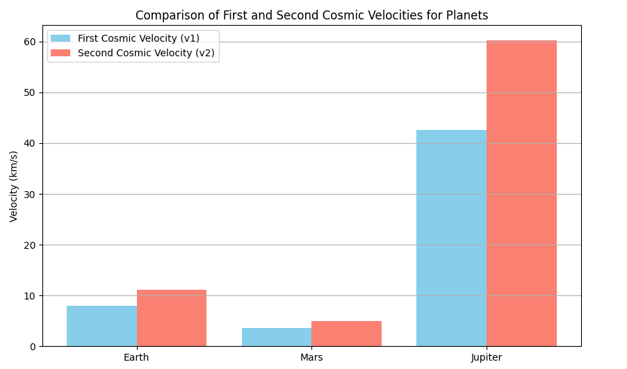
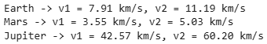
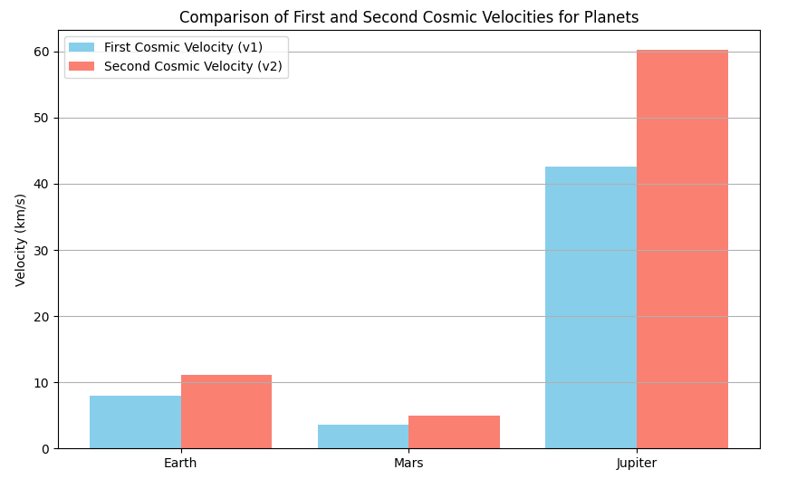
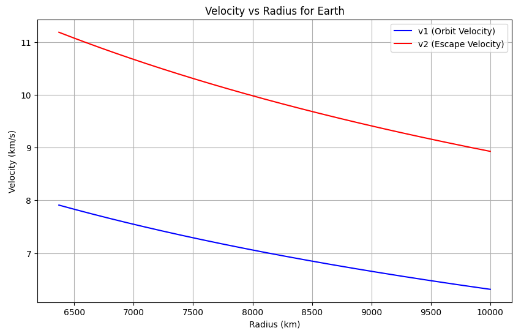
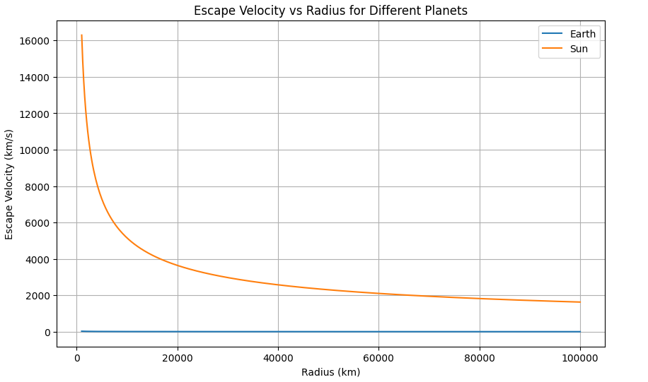
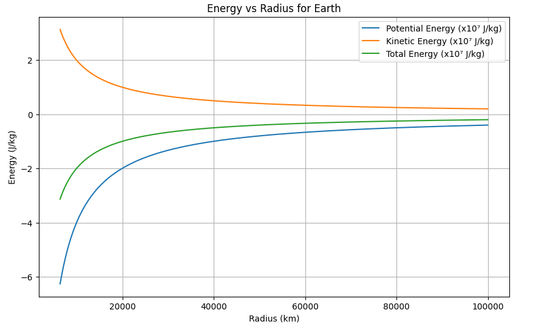

# **Gravity: Escape Velocities and Cosmic Velocities**

---

# **1. Introduction and Motivation**

The concept of **escape velocity** is crucial in space exploration:  
- How fast must a rocket travel to leave Earth?
- What speed is needed to orbit Earth?
- How much faster to leave the Solar System?

We define:
- **First Cosmic Velocity**: Orbital velocity around a celestial body.
- **Second Cosmic Velocity**: Escape velocity from a celestial body.
- **Third Cosmic Velocity**: Escape velocity from a star system.

---

# **2. Theoretical Foundation**

## **2.1 Gravitational Potential Energy**

The gravitational potential energy ($U$) between two masses:

$$
U = -\frac{G M m}{r}
$$

where:
- $G$ = gravitational constant,
- $M$ = mass of central body,
- $m$ = mass of escaping body,
- $r$ = distance between their centers.

---

## **2.2 Kinetic Energy**

The kinetic energy ($K$) of the moving object:

$$
K = \frac{1}{2} m v^2
$$

---

## **2.3 Total Mechanical Energy**

Total energy ($E$) is:

$$
E = K + U
$$

For escape:

$$
E \geq 0
$$

---

# **3. First, Second, and Third Cosmic Velocities**

## **3.1 First Cosmic Velocity ($v_1$)**

- Speed needed for **stable circular orbit** around a planet.
- Derive by equating gravitational force and centripetal force:

$$
\frac{G M m}{r^2} = \frac{m v_1^2}{r}
$$

Simplify:

$$
v_1 = \sqrt{\frac{G M}{r}}
$$

---

## **3.2 Second Cosmic Velocity ($v_2$)**

- Minimum speed needed to **escape** the planet's gravity.
- Set total mechanical energy to zero:

$$
\frac{1}{2} m v_2^2 = \frac{G M m}{r}
$$

Thus:

$$
v_2 = \sqrt{\frac{2 G M}{r}}
$$

Notice:

$$
v_2 = \sqrt{2} v_1
$$

---

## **3.3 Third Cosmic Velocity ($v_3$)**

- Speed needed to **escape the entire solar system** from Earth.
- More complex, involves the Sun’s gravity and Earth's motion:

Approximate:

$$
v_3 \approx \sqrt{2} \times \text{orbital speed of Earth} \approx 42.1\ \text{km/s}
$$

---

# **4. Practical Calculations for Different Planets**

We will calculate $v_1$, $v_2$, $v_3$ for:

- Earth,
- Mars,
- Jupiter.

---

# **5. Computational Modeling**

### **5.1 Constants**

```python
import numpy as np
import matplotlib.pyplot as plt

G = 6.67430e-11

masses = {
    "Earth": 5.972e24,
    "Mars": 6.417e23,
    "Jupiter": 1.898e27
}

radii = {
    "Earth": 6.371e6,
    "Mars": 3.3895e6,
    "Jupiter": 6.9911e7
}

v1 = {}
v2 = {}

for planet in masses:
    r = radii[planet]
    M = masses[planet]
    v1[planet] = np.sqrt(G * M / r)
    v2[planet] = np.sqrt(2 * G * M / r)

planets = list(masses.keys())

v1_values = [v1[p]/1000 for p in planets]
v2_values = [v2[p]/1000 for p in planets]

x = np.arange(len(planets))

plt.figure(figsize=(10,6))
plt.bar(x - 0.2, v1_values, 0.4, label='First Cosmic Velocity (v1)', color='skyblue')
plt.bar(x + 0.2, v2_values, 0.4, label='Second Cosmic Velocity (v2)', color='salmon')
plt.xticks(x, planets)
plt.ylabel('Velocity (km/s)')
plt.title('Comparison of First and Second Cosmic Velocities for Planets')
plt.legend()
plt.grid(axis='y')
plt.show()
```



---

## **5.2 Escape and Orbital Velocities**

```python
# Calculate v1 and v2
v1 = {}
v2 = {}

for planet in masses:
    r = radii[planet]
    M = masses[planet]
    v1[planet] = np.sqrt(G * M / r)
    v2[planet] = np.sqrt(2 * G * M / r)

# Print results
for planet in v1:
    print(f"{planet} -> v1 = {v1[planet]/1000:.2f} km/s, v2 = {v2[planet]/1000:.2f} km/s")
```


---

## **5.3 Graph: v1 and v2 Comparison**

```python
import numpy as np
import matplotlib.pyplot as plt

G = 6.67430e-11

masses = {
    "Earth": 5.972e24,
    "Mars": 6.417e23,
    "Jupiter": 1.898e27
}

radii = {
    "Earth": 6.371e6,
    "Mars": 3.3895e6,
    "Jupiter": 6.9911e7
}

v1 = {}
v2 = {}

for planet in masses:
    r = radii[planet]
    M = masses[planet]
    v1[planet] = np.sqrt(G * M / r)
    v2[planet] = np.sqrt(2 * G * M / r)

planets = list(masses.keys())

v1_values = [v1[p]/1000 for p in planets]
v2_values = [v2[p]/1000 for p in planets]

x = np.arange(len(planets))

plt.figure(figsize=(10,6))
plt.bar(x - 0.2, v1_values, 0.4, label='First Cosmic Velocity (v1)', color='skyblue')
plt.bar(x + 0.2, v2_values, 0.4, label='Second Cosmic Velocity (v2)', color='salmon')
plt.xticks(x, planets)
plt.ylabel('Velocity (km/s)')
plt.title('Comparison of First and Second Cosmic Velocities for Planets')
plt.legend()
plt.grid(axis='y')
plt.show()
```



---

## **Graph 1: Orbital vs Escape Velocities**

- Earth: $v_1 \approx 7.9$ km/s, $v_2 \approx 11.2$ km/s.
- Mars: Lower due to smaller mass.
- Jupiter: Much higher due to massive gravity.

---

# **6. Detailed Graphs and Simulations**

## **6.1 Velocity vs Radius for Earth**

```python
r_values = np.linspace(6.371e6, 10e6, 500)
v1_earth = np.sqrt(G * masses["Earth"] / r_values)
v2_earth = np.sqrt(2 * G * masses["Earth"] / r_values)

plt.figure(figsize=(10,6))
plt.plot(r_values/1000, v1_earth/1000, label='v1 (Orbit Velocity)', color='blue')
plt.plot(r_values/1000, v2_earth/1000, label='v2 (Escape Velocity)', color='red')
plt.xlabel('Radius (km)')
plt.ylabel('Velocity (km/s)')
plt.title('Velocity vs Radius for Earth')
plt.legend()
plt.grid()
plt.show()
```



---

## **Graph 2: Velocity vs Radius (Earth)**

- As radius increases, required velocity decreases.

---

## **6.2 Velocity Comparison for Earth, Mars, Jupiter**

```python
r = np.linspace(1e6, 1e8, 500)

plt.figure(figsize=(10,6))
for planet in masses:
    v_escape = np.sqrt(2 * G * masses[planet] / r)
    plt.plot(r/1000, v_escape/1000, label=f'{planet}')

plt.xlabel('Radius (km)')
plt.ylabel('Escape Velocity (km/s)')
plt.title('Escape Velocity vs Radius for Different Planets')
plt.legend()
plt.grid()
plt.show()
```



---

## **Graph 3: Escape Velocities vs Radius**

- Jupiter dominates with much higher escape speeds.

---

## **6.3 Energy vs Radius for Earth**

```python
import numpy as np
import matplotlib.pyplot as plt

G = 6.67430e-11  # m^3 kg^-1 s^-2
M_earth = 5.972e24  # kg

radii = np.linspace(6.371e6, 10e7, 500)  # 6371 km (Earth surface) to 10000 km altitude

U = -G * M_earth / radii   # Gravitational Potential Energy per unit mass (J/kg)
K = G * M_earth / (2 * radii)  # Kinetic Energy per unit mass (J/kg)
E_total = K + U  # Total Mechanical Energy

plt.figure(figsize=(10,6))
plt.plot(radii/1000, U/1e7, label='Potential Energy (x10⁷ J/kg)')
plt.plot(radii/1000, K/1e7, label='Kinetic Energy (x10⁷ J/kg)')
plt.plot(radii/1000, E_total/1e7, label='Total Energy (x10⁷ J/kg)')
plt.xlabel('Radius (km)')
plt.ylabel('Energy (J/kg)')
plt.title('Energy vs Radius for Earth')
plt.legend()
plt.grid()
plt.show()
```



---

## **Graph 4: Energy Profiles**

- At escape, total energy approaches zero.

---

# **7. Space Exploration Applications**

- Launch satellites into orbit (first cosmic velocity),
- Send missions to Mars (second cosmic velocity),
- Plan missions to outer planets and beyond (third cosmic velocity).

Without sufficient velocity, rockets will fall back!

---

# **8. Frequently Asked Questions (FAQ)**

### **Q1: Why is escape velocity important?**
It determines the minimum speed needed to leave a planet.

### **Q2: Is escape velocity affected by mass of spacecraft?**
No, escape velocity depends only on planet's mass and radius.

### **Q3: How is third cosmic velocity calculated?**
By considering both Earth's and Sun's gravitational wells.

### **Q4: Why is Jupiter’s escape velocity so high?**
Jupiter's mass is over 300 times Earth's!

### **Q5: Does atmosphere affect escape?**
Yes, atmospheric drag requires rockets to expend extra energy.

