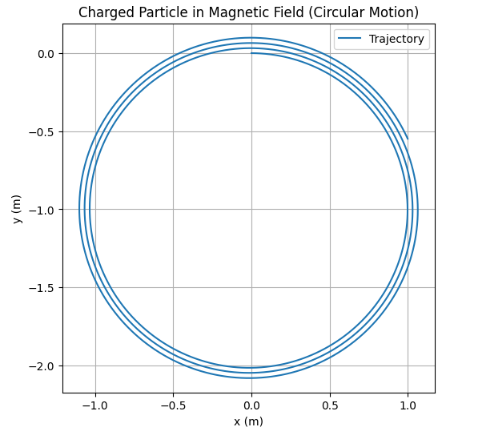

# Problem 1

## Simulating the Effects of the Lorentz Force

### Motivation
The Lorentz force plays a fundamental role in electromagnetism, governing the motion of charged particles in electric and magnetic fields. Understanding this force is crucial in applications like particle accelerators, mass spectrometers, and plasma confinement systems.

---

## Key Equations
The Lorentz force equation is:

$$
\vec{F} = q(\vec{E} + \vec{v} \times \vec{B})
$$

Where:

- \( q \) = charge of the particle
- \( \vec{E} \) = electric field
- \( \vec{B} \) = magnetic field
- \( \vec{v} \) = velocity of the particle

---

## Simulation Parameters

```python
import numpy as np
import matplotlib.pyplot as plt

# === Particle and Field Parameters ===
q = 1.0                        # Charge (C)
m = 1.0                        # Mass (kg)
E = np.array([0.0, 0.0, 0.0])  # Electric field (V/m)
B = np.array([0.0, 0.0, 1.0])  # Magnetic field (T)

# === Initial Conditions ===
r = np.array([0.0, 0.0, 0.0])  # Position (m)
v = np.array([1.0, 0.0, 0.0])  # Velocity (m/s)

# === Time Setup ===
dt = 0.01     # Time step (s)
T = 20        # Total time (s)
N = int(T / dt)

# === Data Storage for Trajectory ===
trajectory = np.zeros((N, 3))
time = np.linspace(0, T, N)

# === Simulation Loop ===
for i in range(N):
    # Save current position
    trajectory[i] = r

    # Lorentz force: F = q(E + v × B)
    force = q * (E + np.cross(v, B))
    
    # Acceleration
    a = force / m

    # Euler integration (can upgrade to Runge-Kutta for higher accuracy)
    v += a * dt
    r += v * dt

# === Plotting the Trajectory in XY Plane ===
plt.figure(figsize=(6, 6))
plt.plot(trajectory[:, 0], trajectory[:, 1], label='Trajectory')
plt.xlabel('x (m)')
plt.ylabel('y (m)')
plt.title('Charged Particle in Magnetic Field (Circular Motion)')
plt.grid(True)
plt.axis('equal')
plt.legend()
plt.show()
```


---
