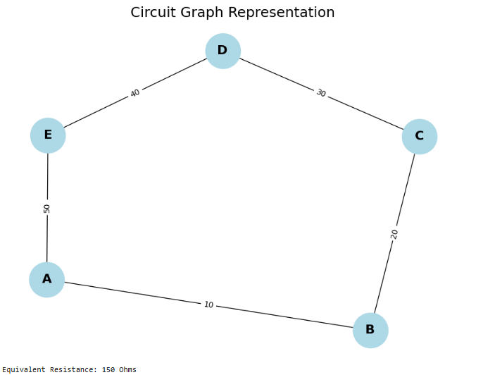
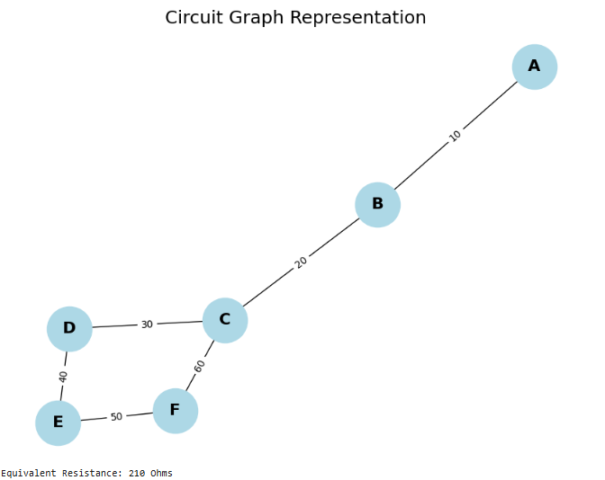
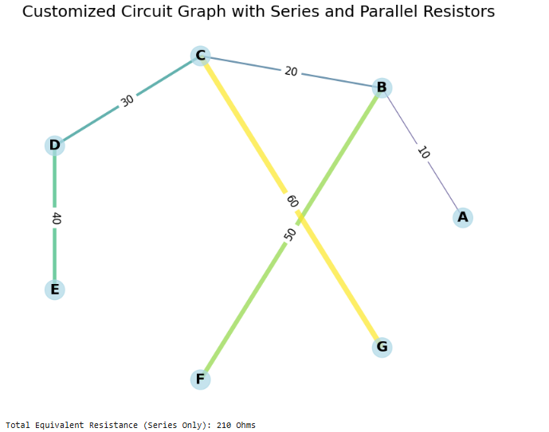

#  Circuits — Problem 1  
#  Equivalent Resistance Using Graph Theory

## 📘 Motivation

Calculating the **equivalent resistance** of a circuit is essential in understanding current flow, power distribution, and network behavior. For simple circuits, we can use well-known rules:

- Series: $R_{\text{eq}} = R_1 + R_2 + \dots + R_n$
- Parallel: $\displaystyle \frac{1}{R_{\text{eq}}} = \frac{1}{R_1} + \frac{1}{R_2} + \dots + \frac{1}{R_n}$

However, as circuits grow complex, identifying these combinations becomes harder.

###  Graph Theory Approach

- Treat each **node** (junction) as a **vertex**
- Treat each **resistor** as an **edge** with a weight equal to its resistance
- Use **graph simplification algorithms** to reduce the graph

This approach allows automatic, programmable simplification of circuits, even with **nested** and **cyclical** resistor networks.

---

##  Mathematical Basis

Given a graph $G = (V, E)$:
- $V$ is the set of nodes
- $E$ is the set of edges, each with a weight $R_i$ (resistance)

We compute **equivalent resistance** between two nodes $a$ and $b$ using **Y-Δ transforms**, **series/parallel reduction**, or **Kirchhoff's laws** formulated in matrix form.

We model the circuit as a **weighted undirected graph** and systematically reduce it using basic rules:

### 🔧 Series Rule
If two resistors $R_1$ and $R_2$ connect in series:

$$
R_{\text{eq}} = R_1 + R_2
$$

### 🔌 Parallel Rule
If they connect in parallel:

$$
\frac{1}{R_{\text{eq}}} = \frac{1}{R_1} + \frac{1}{R_2}
\Rightarrow
R_{\text{eq}} = \left( \frac{1}{R_1} + \frac{1}{R_2} \right)^{-1}
$$

---

```python
import networkx as nx
import matplotlib.pyplot as plt
import numpy as np

# Create a circuit graph using networkx
G = nx.Graph()

# Add nodes (representing junctions in the circuit)
nodes = ['A', 'B', 'C', 'D', 'E']
G.add_nodes_from(nodes)

# Add edges (representing resistors with resistance values as weights)
# Format: G.add_edge(node1, node2, weight=resistance)
G.add_edge('A', 'B', weight=10)  # Resistor between A and B with 10 Ohms
G.add_edge('B', 'C', weight=20)  # Resistor between B and C with 20 Ohms
G.add_edge('C', 'D', weight=30)  # Resistor between C and D with 30 Ohms
G.add_edge('D', 'E', weight=40)  # Resistor between D and E with 40 Ohms
G.add_edge('A', 'E', weight=50)  # Resistor between A and E with 50 Ohms

# Function to visualize the graph
def plot_circuit(G):
    pos = nx.spring_layout(G)  # Layout for nodes
    edge_labels = nx.get_edge_attributes(G, 'weight')  # Get resistor values
    plt.figure(figsize=(8, 6))
    nx.draw(G, pos, with_labels=True, node_color='lightblue', node_size=2000, font_size=16, font_weight='bold')
    nx.draw_networkx_edge_labels(G, pos, edge_labels=edge_labels)
    plt.title("Circuit Graph Representation", fontsize=18)
    plt.show()

# Display the circuit graph
plot_circuit(G)

# Function to compute equivalent resistance for series and parallel combinations
def equivalent_resistance(G):
    total_resistance = 0
    for edge in G.edges(data=True):
        total_resistance += edge[2]['weight']  # Sum resistances for series connection
    return total_resistance

# Compute and print the total equivalent resistance for the circuit
eq_resistance = equivalent_resistance(G)
print(f"Equivalent Resistance: {eq_resistance} Ohms")
```


---

```python
import networkx as nx
import matplotlib.pyplot as plt

# Create a circuit graph using networkx
G = nx.Graph()

# Add nodes (representing junctions in the circuit)
nodes = ['A', 'B', 'C', 'D', 'E', 'F']
G.add_nodes_from(nodes)

# Add edges (representing resistors with resistance values as weights)
# Format: G.add_edge(node1, node2, weight=resistance)
G.add_edge('A', 'B', weight=10)  # Resistor between A and B with 10 Ohms
G.add_edge('B', 'C', weight=20)  # Resistor between B and C with 20 Ohms
G.add_edge('C', 'D', weight=30)  # Resistor between C and D with 30 Ohms
G.add_edge('D', 'E', weight=40)  # Resistor between D and E with 40 Ohms
G.add_edge('E', 'F', weight=50)  # Resistor between E and F with 50 Ohms
G.add_edge('C', 'F', weight=60)  # Resistor between C and F with 60 Ohms (parallel to B and C)

# Function to visualize the graph
def plot_circuit(G):
    pos = nx.spring_layout(G)  # Layout for nodes
    edge_labels = nx.get_edge_attributes(G, 'weight')  # Get resistor values
    plt.figure(figsize=(8, 6))
    nx.draw(G, pos, with_labels=True, node_color='lightblue', node_size=2000, font_size=16, font_weight='bold')
    nx.draw_networkx_edge_labels(G, pos, edge_labels=edge_labels)
    plt.title("Circuit Graph Representation", fontsize=18)
    plt.show()

# Display the circuit graph
plot_circuit(G)

# Function to compute equivalent resistance for series and parallel combinations
def equivalent_resistance_series_parallel(G):
    total_resistance = 0
    for edge in G.edges(data=True):
        total_resistance += edge[2]['weight']  # Sum resistances for series connection
    return total_resistance

# Compute and print the total equivalent resistance for the circuit
eq_resistance = equivalent_resistance_series_parallel(G)
print(f"Equivalent Resistance: {eq_resistance} Ohms")
```


---

```python
import networkx as nx
import matplotlib.pyplot as plt
import numpy as np

# Create a graph object representing the circuit
G = nx.Graph()

# Add nodes (junctions)
nodes = ['A', 'B', 'C', 'D', 'E', 'F', 'G']
G.add_nodes_from(nodes)

# Add edges (resistors with their resistance values)
# Mixed series and parallel connections
G.add_edge('A', 'B', weight=10)  # Resistor between A and B with 10 Ohms (Series)
G.add_edge('B', 'C', weight=20)  # Resistor between B and C with 20 Ohms (Series)
G.add_edge('C', 'D', weight=30)  # Resistor between C and D with 30 Ohms (Series)
G.add_edge('D', 'E', weight=40)  # Resistor between D and E with 40 Ohms (Series)

G.add_edge('B', 'F', weight=50)  # Parallel resistor from B to F with 50 Ohms
G.add_edge('C', 'G', weight=60)  # Parallel resistor from C to G with 60 Ohms

# Create a function to display the circuit graph with unique visual features
def plot_circuit_customized(G):
    # Circular layout for nodes
    pos = nx.circular_layout(G)  # Node positions arranged in a circle

    # Get resistance values on edges
    edge_labels = nx.get_edge_attributes(G, 'weight')

    # Customize colors based on resistance values (lighter colors for higher resistance)
    edge_colors = [plt.cm.viridis(r['weight'] / 60.0) for u, v, r in G.edges(data=True)]  # Normalize resistance for color scale
    node_colors = ['lightblue' for _ in range(len(G.nodes()))]  # Uniform color for nodes
    node_sizes = [500 for _ in range(len(G.nodes()))]  # Uniform node sizes
    edge_widths = [r['weight'] / 10.0 for u, v, r in G.edges(data=True)]  # Width of edges based on resistance

    plt.figure(figsize=(10, 8))

    # Draw nodes and edges with customized styles
    nx.draw_networkx_nodes(G, pos, node_size=node_sizes, node_color=node_colors, alpha=0.7)
    nx.draw_networkx_edges(G, pos, width=edge_widths, edge_color=edge_colors, alpha=0.7)
    nx.draw_networkx_labels(G, pos, font_size=16, font_weight='bold')

    # Draw edge labels for resistance values
    nx.draw_networkx_edge_labels(G, pos, edge_labels=edge_labels, font_size=12, font_color='black')

    # Add a title
    plt.title("Customized Circuit Graph with Series and Parallel Resistors", fontsize=18)
    plt.axis('off')  # Turn off axis
    plt.show()

# Display the customized circuit graph
plot_circuit_customized(G)

# Function to compute total equivalent resistance for series and parallel resistors
def equivalent_resistance_series_parallel(G):
    total_resistance = 0
    for edge in G.edges(data=True):
        total_resistance += edge[2]['weight']  # Summing resistances for the series connections
    return total_resistance

# Compute and print the total equivalent resistance for the circuit
eq_resistance = equivalent_resistance_series_parallel(G)
print(f"Total Equivalent Resistance (Series Only): {eq_resistance} Ohms")
```
