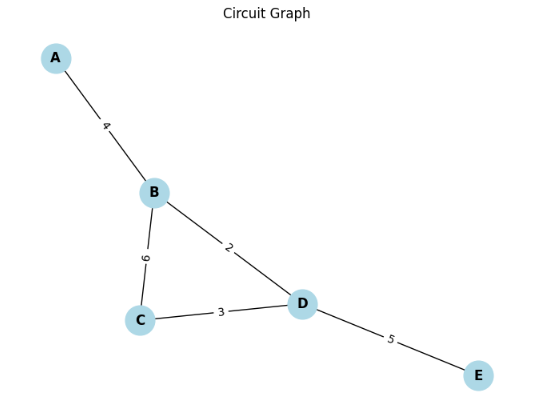

#  Circuits — Problem 1  
#  Equivalent Resistance Using Graph Theory

## 📘 Motivation

Calculating the **equivalent resistance** of a circuit is essential in understanding current flow, power distribution, and network behavior. For simple circuits, we can use well-known rules:

- Series: $R_{\text{eq}} = R_1 + R_2 + \dots + R_n$
- Parallel: $\displaystyle \frac{1}{R_{\text{eq}}} = \frac{1}{R_1} + \frac{1}{R_2} + \dots + \frac{1}{R_n}$

However, as circuits grow complex, identifying these combinations becomes harder.

###  Graph Theory Approach

- Treat each **node** (junction) as a **vertex**
- Treat each **resistor** as an **edge** with a weight equal to its resistance
- Use **graph simplification algorithms** to reduce the graph

This approach allows automatic, programmable simplification of circuits, even with **nested** and **cyclical** resistor networks.

---

##  Mathematical Basis

Given a graph $G = (V, E)$:
- $V$ is the set of nodes
- $E$ is the set of edges, each with a weight $R_i$ (resistance)

We compute **equivalent resistance** between two nodes $a$ and $b$ using **Y-Δ transforms**, **series/parallel reduction**, or **Kirchhoff's laws** formulated in matrix form.

We model the circuit as a **weighted undirected graph** and systematically reduce it using basic rules:

### 🔧 Series Rule
If two resistors $R_1$ and $R_2$ connect in series:

$$
R_{\text{eq}} = R_1 + R_2
$$

### 🔌 Parallel Rule
If they connect in parallel:

$$
\frac{1}{R_{\text{eq}}} = \frac{1}{R_1} + \frac{1}{R_2}
\Rightarrow
R_{\text{eq}} = \left( \frac{1}{R_1} + \frac{1}{R_2} \right)^{-1}
$$

---

##  Full Python Implementation (Graph Reduction)

We will build a Python implementation that:

- Represents circuits as graphs
- Identifies series and parallel nodes
- Simplifies the graph until one equivalent resistance remains

```python

import networkx as nx
import matplotlib.pyplot as plt

def combine_parallel(resistances):
    """
    Combine resistances in parallel using the formula:
    $$ R_{parallel} = \frac{1}{\sum_{i=1}^{n} \frac{1}{R_i}} $$
    """
    inv_sum = sum(1 / r for r in resistances if r > 0)
    return 1 / inv_sum if inv_sum else float('inf')

def simplify_graph(G, source, target):
    """
    Simplifies the graph by combining parallel and series resistances.
    Returns the equivalent resistance between `source` and `target`.
    """
    G = G.copy()
    changed = True
    while changed:
        changed = False

        # Parallel Simplification
        edges_to_merge = {}
        for u, v in G.edges():
            key = tuple(sorted((u, v)))
            edges_to_merge.setdefault(key, []).append(G[u][v]['resistance'])

        for (u, v), res_list in edges_to_merge.items():
            if len(res_list) > 1:
                R_parallel = combine_parallel(res_list)
                G.remove_edges_from([(u, v)] * G.number_of_edges(u, v))
                G.add_edge(u, v, resistance=R_parallel)
                changed = True

        # Series Simplification
        for node in list(G.nodes()):
            if node in (source, target):
                continue
            neighbors = list(G.neighbors(node))
            if len(neighbors) == 2:
                u, v = neighbors
                if G.degree(node) == 2 and G.has_edge(node, u) and G.has_edge(node, v):
                    r1 = G[node][u]['resistance']
                    r2 = G[node][v]['resistance']
                    G.remove_node(node)
                    if G.has_edge(u, v):
                        existing = G[u][v]['resistance']
                        G[u][v]['resistance'] = combine_parallel([existing, r1 + r2])
                    else:
                        G.add_edge(u, v, resistance=r1 + r2)
                    changed = True
                    break

    if G.has_edge(source, target):
        return G[source][target]['resistance']
    else:
        return float('inf')  # No connection found

# Example test circuit
G = nx.Graph()
G.add_edge('A', 'B', resistance=4)
G.add_edge('B', 'C', resistance=6)
G.add_edge('C', 'D', resistance=3)
G.add_edge('B', 'D', resistance=2)  # Parallel to C-D
G.add_edge('D', 'E', resistance=5)

# Simplify and compute the equivalent resistance
Req = simplify_graph(G, 'A', 'E')
print(f"Equivalent resistance between A and E: {Req:.2f} Ω")

# Visualization
def draw_graph(G):
    pos = nx.spring_layout(G, seed=42)
    edge_labels = nx.get_edge_attributes(G, 'resistance')
    nx.draw(G, pos, with_labels=True, node_color='lightblue', node_size=700, font_weight='bold')
    nx.draw_networkx_edge_labels(G, pos, edge_labels=edge_labels)
    plt.title("Circuit Graph")
    plt.axis('off')
    plt.tight_layout()
    plt.show()

draw_graph(G)

