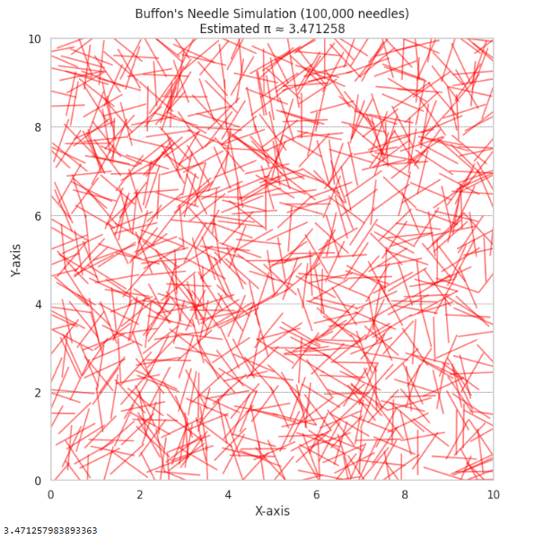

#  Estimating Pi Using Monte Carlo Methods

##  Motivation

Monte Carlo simulations use **random sampling** to approximate values or solve problems that may be analytically intractable. One beautiful and intuitive application of this technique is estimating the value of **$\pi$**.

Two classical geometric approaches to estimating $\pi$ using Monte Carlo methods are:

- **Random Point Sampling in a Circle**
- **Buffon's Needle Experiment**

These methods link geometry, probability, and numerical computation — demonstrating how randomness can lead to accurate estimates.

---

##  Part 1: Estimating $\pi$ Using a Unit Circle

###  Theoretical Foundation

Imagine a **unit circle** inscribed inside a square with side length 2.

- The **area of the square** is $4$ (since $2 \times 2 = 4$).
- The **area of the circle** is $\pi r^2 = \pi$ (since $r=1$).

If we randomly generate points inside the square, the ratio of points falling **inside the circle** approximates the ratio of their areas:

$$
\frac{\text{Points in circle}}{\text{Total points}} \approx \frac{\pi}{4}
$$

So,

$$
\pi \approx 4 \times \frac{\text{Points in circle}}{\text{Total points}}
$$

---

##  Part 2: Code Implementation (Circle Method)

```python
# Estimating Pi Using Monte Carlo - Circle Method

import numpy as np
import matplotlib.pyplot as plt

# Function to estimate pi using point sampling
def estimate_pi(num_points=10000, visualize=True):
    x = np.random.uniform(-1, 1, num_points)
    y = np.random.uniform(-1, 1, num_points)

    distances = x**2 + y**2
    inside = distances <= 1

    pi_estimate = 4 * np.sum(inside) / num_points

    if visualize:
        plt.figure(figsize=(6, 6))
        plt.scatter(x[inside], y[inside], color='skyblue', s=1, label='Inside Circle')
        plt.scatter(x[~inside], y[~inside], color='salmon', s=1, label='Outside Circle')
        circle = plt.Circle((0, 0), 1, color='black', fill=False, linewidth=1)
        plt.gca().add_artist(circle)
        plt.title(f"Monte Carlo Pi Estimation\nEstimated π ≈ {pi_estimate:.6f}")
        plt.xlabel("x")
        plt.ylabel("y")
        plt.axis('equal')
        plt.legend()
        plt.show()

    return pi_estimate

# Run estimation
estimate_pi(10000)
```

.png>)

---

# Estimating Pi Using Buffon's Needle (Improved Accuracy with 100,000 needles)

```python
import numpy as np
import matplotlib.pyplot as plt

def buffon_pi_fixed(num_needles=100000, L=1.0, d=2.0, visualize=True):
    hits = 0
    centers = np.random.uniform(0, 10, size=num_needles)        # y-coordinates of needle centers
    angles = np.random.uniform(0, np.pi, size=num_needles)      # angles in radians

    for i in range(num_needles):
        y_center = centers[i]
        theta = angles[i]

        y1 = y_center - (L / 2) * np.sin(theta)
        y2 = y_center + (L / 2) * np.sin(theta)

        # Check if the needle crosses a line (i.e., straddles two different "bands")
        if int(y1 / d) != int(y2 / d):
            hits += 1

    if hits == 0:
        print("No hits — increase number of needles or check logic.")
        return None

    pi_estimate = (2 * L * num_needles) / (d * hits)

    if visualize:
        plt.figure(figsize=(8, 8))
        # Draw parallel lines
        for y in np.arange(0, 10 + d, d):
            plt.axhline(y=y, color='gray', linestyle='--', linewidth=0.5)

        # Only visualize a sample of needles for clarity (e.g. 1000)
        sample_size = 1000
        for i in range(sample_size):
            y_center = centers[i]
            theta = angles[i]
            x_center = np.random.uniform(0, 10)
            x1 = x_center - (L / 2) * np.cos(theta)
            x2 = x_center + (L / 2) * np.cos(theta)
            y1 = y_center - (L / 2) * np.sin(theta)
            y2 = y_center + (L / 2) * np.sin(theta)
            plt.plot([x1, x2], [y1, y2], color='red', alpha=0.5)

        plt.title(f"Buffon's Needle Simulation (100,000 needles)\nEstimated π ≈ {pi_estimate:.6f}")
        plt.xlim(0, 10)
        plt.ylim(0, 10)
        plt.xlabel("X-axis")
        plt.ylabel("Y-axis")
        plt.gca().set_aspect('equal')
        plt.grid(True, linestyle='--', linewidth=0.3)
        plt.show()

    return pi_estimate

# Run high-accuracy simulation
buffon_pi_fixed(num_needles=100000)
```

