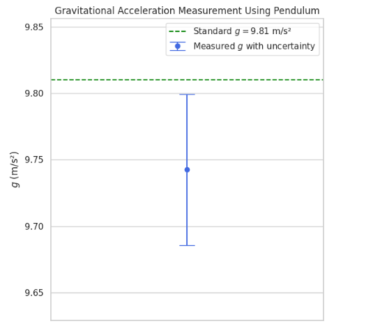
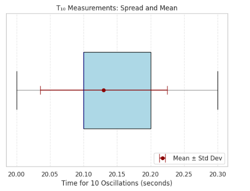

# 🌍 Measuring Earth's Gravitational Acceleration with a Pendulum

## 📘 Motivation

The acceleration due to gravity ($g$) is a fundamental physical constant that governs motion on Earth. One classical and elegant method to measure $g$ is using a **simple pendulum**, whose oscillation period is directly related to $g$.

This experiment reinforces:

- Core principles of periodic motion
- Quantitative measurement techniques
- Uncertainty analysis in real-world data collection

---

## 🔬 Theory: Pendulum and Gravitational Acceleration

For small angles ($\theta < 15^\circ$), the period $T$ of a simple pendulum is related to gravity $g$ and the pendulum length $L$ as:

$$
T = 2\pi \sqrt{\frac{L}{g}} \Rightarrow g = \frac{4\pi^2 L}{T^2}
$$

To determine $g$ experimentally:

1. Measure $L$ (length from pivot to mass center)
2. Measure $T$ (oscillation period)
3. Calculate $g$ using the formula above

---

## 🛠️ Setup

**Materials Required:**

- A string (1–1.5 meters)
- A small weight (key, coin pouch, sugar bag)
- Stopwatch or smartphone timer
- Ruler or measuring tape

---

## 📏 Data Collection Steps

1. Attach the weight securely and measure the **length $L$** from the pivot to the center of mass of the weight.

2. Pull the pendulum to a small angle (<15°) and release.

3. Measure the **time $T_{10}$** for 10 full oscillations — repeat this **10 times** and record all values.

4. Calculate the **mean $\bar{T}_{10}$** and **standard deviation $\sigma_T$**.

5. Compute uncertainty in the mean time using:

$$
\Delta T_{10} = \frac{\sigma_T}{\sqrt{n}}, \quad \text{where } n = 10
$$

6. Convert to single-period values:

$$
T = \frac{\bar{T}_{10}}{10}, \quad \Delta T = \frac{\Delta T_{10}}{10}
$$

---

## 🧮 Code Implementation

```python
import numpy as np
import matplotlib.pyplot as plt

# === INPUTS ===
L = 1.00  # Pendulum length (m)
delta_L = 0.005  # Uncertainty in length

# 10 measurements of time for 10 oscillations (seconds)
T10_measurements = [20.1, 20.2, 20.0, 20.3, 20.1, 20.2, 20.1, 20.2, 20.1, 20.0]
n = len(T10_measurements)

# === CALCULATIONS ===
T10_array = np.array(T10_measurements)
T10_mean = np.mean(T10_array)
T10_std = np.std(T10_array, ddof=1)
delta_T10 = T10_std / np.sqrt(n)

# Convert to single oscillation period
T = T10_mean / 10
delta_T = delta_T10 / 10

# Compute gravitational acceleration
g = (4 * np.pi**2 * L) / (T**2)

# Uncertainty in g
rel_L = (delta_L / L)**2
rel_T = (2 * delta_T / T)**2
delta_g = g * np.sqrt(rel_L + rel_T)

# === VISUALIZATION ===
plt.figure(figsize=(6, 6))
plt.errorbar(1, g, yerr=delta_g, fmt='o', capsize=10, color='royalblue', label='Measured $g$ with uncertainty')
plt.axhline(9.81, color='green', linestyle='--', label='Standard $g = 9.81$ m/s²')

plt.xlim(0, 2)
plt.ylim(g - 2*delta_g, g + 2*delta_g)
plt.title("Gravitational Acceleration Measurement Using Pendulum")
plt.ylabel("$g$ (m/s²)")
plt.xticks([])  # Hide x-axis ticks
plt.legend()
plt.grid(True)
plt.tight_layout()
plt.show()
```


---

```python
import numpy as np
import matplotlib.pyplot as plt

# === TIME MEASUREMENTS ===
T10_measurements = [20.1, 20.2, 20.0, 20.3, 20.1, 20.2, 20.1, 20.2, 20.1, 20.0]
T10_array = np.array(T10_measurements)
T10_mean = np.mean(T10_array)
T10_std = np.std(T10_array, ddof=1)

# === PLOT ===
plt.figure(figsize=(6, 5))

# Boxplot of T10 measurements
plt.boxplot(T10_array, vert=False, widths=0.5, patch_artist=True,
            boxprops=dict(facecolor='lightblue', color='black'),
            medianprops=dict(color='darkblue'),
            whiskerprops=dict(color='gray'),
            capprops=dict(color='black'),
            flierprops=dict(markerfacecolor='red', marker='o', markersize=6))

# Add mean + std deviation line
plt.errorbar(T10_mean, 1, xerr=T10_std, fmt='o', color='darkred',
             capsize=8, label='Mean ± Std Dev')

plt.title("T₁₀ Measurements: Spread and Mean")
plt.xlabel("Time for 10 Oscillations (seconds)")
plt.yticks([])
plt.grid(True, linestyle='--', alpha=0.5)
plt.legend(loc='lower right')
plt.tight_layout()
plt.show()
```
